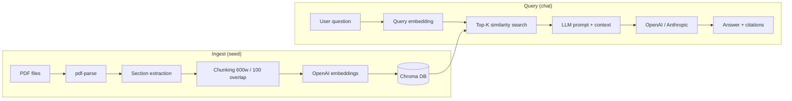

# Architecture — DocAsk RAG Pipeline

This document describes the end-to-end retrieval-augmented generation (RAG) flow in the DocAsk demo.

## Overview

DocAsk answers employee questions by retrieving relevant passages from synthetic Acme Logistics policy PDFs, then generating a grounded response with citations.

## Components

### 1. PDF ingestion (`IngestService`)

- Reads all `.pdf` files from `sample-data/pdfs/`
- Parses text with `pdf-parse`
- Extracts sections by detecting numbered headings (e.g. `1. Welcome`)
- Falls back to word-based chunking if section detection yields nothing

### 2. Chunking (`ChunkingService`)

- Target size: **600 words** (~500–800 tokens) with **100-word overlap**
- Each chunk carries metadata: `documentName`, `section`, `chunkIndex`
- Chunk IDs are stable: `{documentName}::{index}`

### 3. Embeddings (`EmbeddingService`)

Configured via `EMBEDDING_PROVIDER` (`apps/api/src/config/embedding.config.ts`):

| Provider | Use case | Env |
|----------|----------|-----|
| `openai-compatible` | Ollama, LM Studio (default for local) | `EMBEDDING_BASE_URL`, `EMBEDDING_MODEL` |
| `openai` | OpenAI cloud | `OPENAI_API_KEY`, `OPENAI_EMBEDDING_MODEL` |

- Batched in groups of 50 for ingest efficiency
- Same model/provider used for query embedding at retrieval time
- **Re-seed required** when switching providers (vector dimensions may differ)

### 4. Vector store (`VectorStoreService`)

- **Chroma** collection: `acme_policies` (configurable)
- Stores document text, embedding vectors, and metadata
- `resetCollection()` clears and rebuilds on each seed run
- Similarity search returns top-K chunks with distance-based scores

### 5. LLM generation (`LlmService` + provider adapters)

Provider selected via `LLM_PROVIDER`. Three adapter types:

| Adapter | Providers | Implementation |
|---------|-----------|----------------|
| **OpenAI-compatible** | `openai`, `ollama`, `openrouter`, `openai-compatible` | OpenAI SDK with preset or custom `LLM_BASE_URL` |
| **Anthropic** | `anthropic` | `@anthropic-ai/sdk` |
| **Gemini** | `gemini` | `@google/generative-ai` |

Resolution logic lives in `apps/api/src/config/llm.config.ts`. Factory: `apps/api/src/rag/llm/llm-provider.factory.ts`.

Embeddings remain independent (OpenAI by default) — you can run Ollama for chat while keeping OpenAI embeddings for retrieval quality.

Chat flow (`ChatService`):

1. Embed the user question
2. Query Chroma for top-K chunks (default K=5)
3. Build a system prompt with retrieved excerpts
4. Call the active LLM adapter
5. Return answer, deduplicated citations, and raw source chunks

## API endpoints

| Method | Path | Purpose |
|--------|------|---------|
| `GET` | `/health` | Chroma connectivity, chunk count, active LLM provider |
| `POST` | `/ingest` | Rebuild vector index from PDFs |
| `POST` | `/chat` | Ask a question `{ question, history? }` |

## Configuration

All tunables live in `.env` (see `.env.example`):

- `CHUNK_SIZE`, `CHUNK_OVERLAP`, `RETRIEVAL_TOP_K`
- `CHROMA_HOST`, `CHROMA_PORT`, `CHROMA_COLLECTION`
- `LLM_PROVIDER`, provider-specific API keys and models

## Design decisions

| Decision | Rationale |
|----------|-----------|
| NestJS monolith API | Matches resume stack; clear module boundaries |
| Chroma (local Docker) | Simple setup, no managed infra for portfolio demo |
| Word-based chunking | Good enough for structured policy PDFs; no tiktoken dep |
| Seed script rebuilds index | Reproducible demos; idempotent ingest |
| No auth / no upload | Keeps scope weekend-sized; focuses on RAG core |

## Extension points

- **LangGraph**: Add a router node (HR vs IT vs Finance) before retrieval
- **Hybrid search**: Combine Chroma similarity with BM25 keyword match
- **Local embeddings**: Swap `EmbeddingService` when `EMBEDDING_PROVIDER=local`
- **Re-ranking**: Cross-encoder pass on top-K before LLM call
